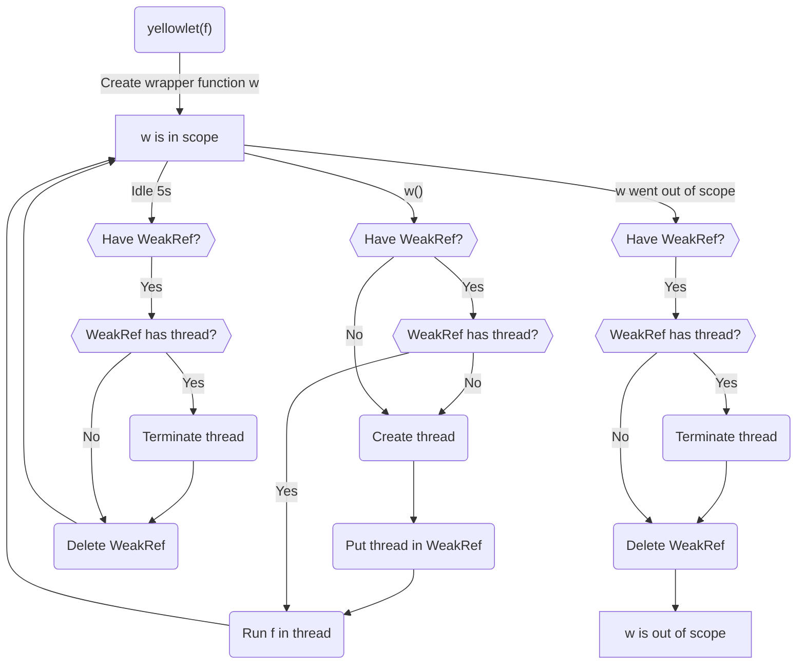

# Yellowlet

🟨 Run an async function in a Worker thread and wait for it synchronously

⏱ Makes async functions happen synchronously \
💡 Inspired by [developit/greenlet] and [un-ts/synckit] \
🗑 Tries to efficiently dispose of unused threads \
🚌 Supports [`Transferable`] objects

🛑 Try to use native async/await when possible! You don't want your HTTP server to freeze while waiting for something to happen, right?

## Installation

You can install this package locally using npm, [pnpm], [Yarn], or whatever package manager you like! The npm name/ID of this package is `@jcbhmr/yellowlet`.

```sh
npm install @jcbhmr/yellowlet
```

⚠️ This is a **Node.js-only** package. It relies on a synchronous `recieveMessageOnPort()` polling check that isn't exposed in the browser.

## Usage

```js
import yellowlet from "@jcbhmr/yellowlet";

const get = yellowlet(async (url) => {
  const response = await fetch(url);
  return await response.text();
});

// Look mom, no await! 😎
const text = get("https://example.org/");
console.log(text);
//=> '<!DOCTYPE html>...'
```

### Lifecycle

When you call `yellowlet()`, a thread is not immediately created; only when you first call the returned function is a thread spun up for you. All `yellowlet()`-returned functions share a **single** thread across all of them. This is OK because the function string and arguments are passed as a tuple to be executed on-the-fly inside the `Worker` context. After a while of inactivity, the worker thread is closed down. Don't worry though, it will be spun back up if/when the function is invoked again. After all functions are garbage-collected (as tracked by `FinalizationRegistry`), the worker thread is terminated.

The gist for users is that you should try to refrain from interacting with global state as much as possible, because this is a textbook worklet, not a worker! It's a small lightweight thread that is short-lived and spun up/down potentially many times.



[developit/greenlet]: https://github.com/developit/greenlet#readme
[un-ts/synckit]: https://github.com/un-ts/synckit#readme
[`Transferable`]: 
